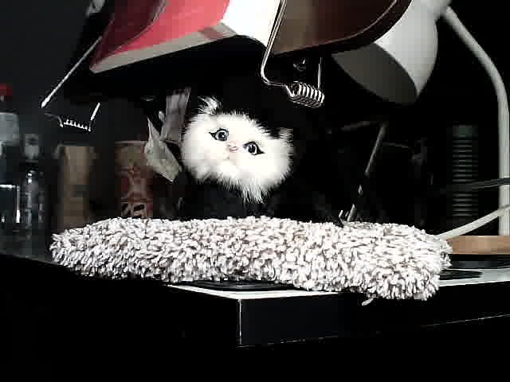

# Experiment: repeatability of SmolVLM2-500M on a single static scene

**Date:** 2026-08-20 · **Board:** Arduino UNO Q · **Backend:** CPU (4 threads), the working
configuration from [`arduino_uno_q/`](../../arduino_uno_q/)



## Correction: this analysis was revised

The first version of this write-up scored the model against the operator's *recollection* of
the scene — "a stuffed cat on a rug with a red book on top." When the actual captured frame
was retrieved (above), that description turned out to be an incomplete account of a dark,
cluttered desk. The revision matters:

- **`bottle` was scored as the single most common hallucination (7/20). There is a real
  bottle at the left edge.** Those were correct detections marked wrong.
- **`towel` / `cushion` / `cloth` were scored as hallucinations.** They refer to the shaggy
  mop head dominating the foreground — a fair reading of a genuinely ambiguous object.
- **The "red book" was scored as missed in 19/20 runs.** The red object is real but sits
  cropped and edge-on at the top of the frame; it is barely identifiable as a book at all.

Measured hallucination fell from 1.3 to **0.7 objects per run** once the ground truth came
from the image instead of from memory. **Recall figures below are against the frame.**

The lesson is worth more than the numbers: *ground truth must come from what the sensor
recorded, not from what the operator remembers putting there.* The original caveat — "the
frame itself was not saved, so image quality cannot be re-examined" — turned out to be the
most important line in the document.

## Method

The webcam was pointed at an unchanging scene and `run_vlm.sh -interval 5s` was left running
for 20 consecutive inferences with an identical prompt. **The image never changed.** Any
variation in the output is variation in the model, not the scene.

This separates two questions a single run cannot:

1. **Accuracy** — is the description right? (needs ground truth, and see above for how easily
   that goes wrong)
2. **Repeatability** — do repeated runs agree with *each other*? (needs no ground truth at
   all, because the input is constant)

## The frame itself

| Property | Value |
|---|---|
| Resolution | 640×480 |
| Mean luma | 56.6 / 255 |
| Pixels below luma 32 | **64%** |
| Pixels below luma 64 | 72% |

**Two thirds of the frame is near-black.** The subject is small, off-centre, low-contrast and
surrounded by indistinct dark shapes. This is a hard image, and a meaningful share of the
model's trouble is attributable to the scene rather than the model.

## Results

### Element recall (against the actual frame)

| Element | Detected | Recall |
|---|---|---|
| cat | 19/20 | 95% |
| shaggy foreground object | 14/20 | 70% |
| darkness of the scene | 12/20 | 60% |
| red object | 11/20 | 55% |
| bottle (left edge) | 7/20 | 35% |
| **stuffed / toy, not alive** | **2/20** | **10%** |

### Misidentification

**13/20 runs named an object with no counterpart in frame**, averaging 0.7 per run: helmet
(×4), skateboard (×3), scooter, shoe box, harness, spray paint, chair, bowl.

These are *misreadings of real dark shapes*, not inventions from nothing — which is a
different and somewhat more forgivable failure than the first analysis implied.

### Repeatability — unchanged, and still the headline

Pairwise word overlap (Jaccard, all 190 pairs) on an **identical image**:

- **mean 0.12**, min 0.03, max 0.28

This number needs no ground truth, so **the correction above does not touch it.** Successive
descriptions of one unchanging image share about an eighth of their content words. They are
effectively independent guesses.

One run also repeated two sentences verbatim (degenerate decoding).

### Latency — the one stable thing

- mean **57.2 s**, stdev **1.3 s**, min 54.1 s, max 58.3 s (7% spread)

## Findings

**1. Timing is reliable; content is not.** ±1.3 s on latency versus 0.12 agreement on
content. Everything unreliable is in the output, not the runtime.

**2. The model sees texture and colour, not identity.** It reliably reports *a shaggy pale
thing* (70%), *something red* (55%), *a dark scene* (60%) — and then attaches a different
noun to the red thing nearly every run: helmet, skateboard, scooter, hat, shoe box. Low-level
features survive; object identity does not.

**3. The one consistent, genuine failure is "alive vs. toy."** 18/20 runs describe a live
animal — curious eyes, playful moods, in one case urination. For a robot, this is the
error that matters: acting on "there is a cat here" when there is a plush toy.

**4. Fluency masks everything.** Every output is confident, detailed, grammatical prose,
whether it is right or wrong. The model has no way to say "I am not sure" — the same failure
mode as the black-frame trap in the main README.

**5. The scene is a co-defendant.** 64% near-black pixels, cluttered background, small
off-centre subject. Before concluding the model is inadequate, fix the lighting and framing
and re-run.

## Implications for the manipulator project

- **Do not use free-form description as a perception input.** 0.12 run-to-run agreement is
  not a signal a controller can act on.
- **Ask closed questions.** "Is there a red object? yes/no" is both more likely to be reliable
  and trivially checkable, where "describe the scene" is neither.
- **Fix the image before blaming the model.** Light the workspace, fill the frame with the
  subject, and re-measure. This is free compared to changing models.
- **Repeatability is the cheapest test available.** No labels, just a fixed camera — and it
  was the only metric the ground-truth error did not corrupt.

## Next experiments

1. **Re-run with good lighting and tight framing.** The obvious first move, and it isolates
   scene quality from model capability.
2. Closed-form questions ("is there a book? yes/no") vs. free description.
3. A larger model (SmolVLM2-2.2B) if it fits in 3.6 GB — capacity limit or quantization?
4. Q8_0 vs Q4 at equal size, to separate quantization damage from capacity.

## Files

| File | What |
|---|---|
| `captured_frame.jpg` | **The frame the model actually saw** — retrieved from the board |
| `raw_log.txt` | Verbatim console output of all 20 runs |
| `ground_truth.json` | Scene description and match terms, derived from the frame |
| `evaluate.py` | The evaluator (stdlib only) |
| `RESULTS.md` | Generated report |

```bash
python3 evaluate.py raw_log.txt ground_truth.json
```

**Caveats.** Keyword matching approximates understanding rather than measuring it. Word-
boundary matching is used because substring matching silently inflates counts ("hat" inside
"that", "red" inside "covered") — an early version of this script had exactly that bug.
`captured_frame.jpg` was captured after the 20-run session, with the camera and scene
unchanged, so it is representative rather than the literal frame from each run.
